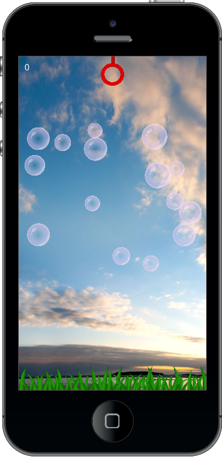

Bubble Popper for the CoronaSDK

This template was constructed to demonstrate many aspects of programming in lua for Corona.

You will learn

1. How to implement object orientated design patterns in lua
2. "Class" instantiation
3. How to create event handlers for collision and touch
4. How to create event handlers that are contained within your external "Class" modules
5. Display object layering similar to using a paint program
6. Nested timer mechanics and proper shutdown techniques
7. How to return events to a calling module
8. transition effects

And a lot more!

Download.  Learn.  Make it your own.

